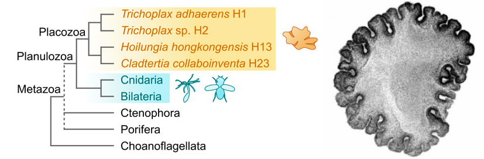
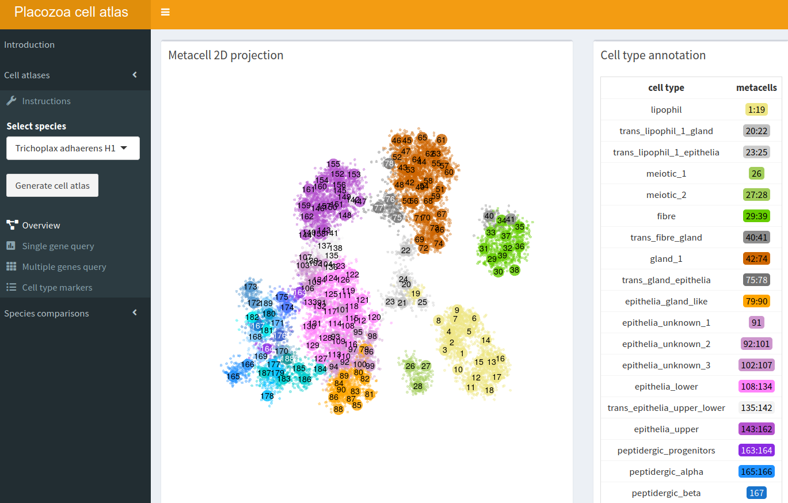

# Cell type evolution and diversity in placozoans

This repository contains all necessary scripts to reproduce the single-cell atlases of the placozoans *Trichoplax adhaerens* (H1), *Trichoplax* sp. (H2), *Hoilungia hongkongensis* (H13), and *Cladtertia collaboinventa* (H23), presented in our manuscript [here](https://github.com/sebepedroslab/placozoa-cell-type-evol).



## Analyses

Check instructions in each of these folders.

1. **Single-cell atlases** for each species, in the [`results_scatlas/`](results_scatlas/) folder. This covers all steps from mapping to the final `metacell` clustering and cell type classification for each species, as well as creating expression maps, 2D projections, and dedicated expression plots for certain markers (TFs, GPCRs, etc.).
2. **Cross-species comparisons** within placozoa and with other metazoan species, in [`results_crosssps/`](results_crosssps/).
3. **Gene module analyses**, in [`results_gene_modules/`](results_gene_modules/). This includes the analysis of placozoan-specific gene modules, and the analyses of neural-related gene modules across metazoans.g
4. **Phylogenomics** in [`results_phylogenomics/`](results_phylogenomics). Includes instructions to reproduce our single-gene marker phylogenomics datasets, and run the species trees with IQ-TREE and Phylobayes.

## Browse the data

You can browse the results from our analyses in [this ShinyApp](https://sebelab.crg.eu/placozoa_cell_atlas/).



## Access the data

We provide the following [raw data](results_scatlas/data/scdb) for each species (indicated with the acronyms `Tadh`, `TrH2`, `Hhon` and `HoiH23`, for *Trichoplax adhaerens* H1, *Trichoplax* sp. H2, *Hoilungia hongkongensis* H13, and *Cladtertia collaboinventa* H23, respectively):

* **UMI matrices**, which are files starting with the **`mat` prefix**. For all analyses, we used matrices indicated with the `it2` suffix (previous iterations correspond to intermediate steps). These are sparse matrices stored as R objects, specifically [metacell package](https://tanaylab.github.io/metacell/)-type `mat` objects. See below for an example of how to load these matrices into R.
* **Cell-metacell assignment files** indicated with the **`mc` prefix**. For all analyses, we used matrices indicated with the `it4` suffix (previous iterations correspond to intermediate steps). 
* **Two-dimensional porjection** objects indicated in the **`mc2d` prefix**. 
* Other objects used by metacell such as gene statistics, gene sets, cell coclustering data... Please refer to the appropriate scripts in the [`results_scatlas`](results_scatlas/`) folder for details.

UMI matrices in the metacell `mat` format can be read into R as follows:

```R
# from the `scdb` folder
# load metacell library
library("metacell")
# initialise metacell db
metacell::scdb_init(".", force_reinit = TRUE)
# read object, using its ID to refer to it (in this case, the `scdr_Tadh_it2` bit); there ara analogous files
mat = metacell::scdb_mat("scdr_Tadh_it2")
# sparse matrix available in the mat@mat slot
dim(mat@mat)
```

The [metacell package]([url](https://tanaylab.github.io/metacell/)) contains analogous functions to load other `metacell`-formatted data files, such as cell clusterings in `mc` objects (which specify which cells in the UMI matrix belong to each metacell cluster).

We also provide **metacell-cell type assignment tables**, with our cell type annotations for each metacell. The final annotations are stored here [`results_scatlas/results_metacell_it4/`](results_scatlas/results_metacell_it4/), and look like this:

```bash
head annotation_mc.Tadh.it4.reordered.tsv
# metacell	cell_type	color	broad_cell_type	metacell_it2
# 1	lipophil	khaki2	lipophil	1
# 2	lipophil	khaki2	lipophil	2
# 3	lipophil	khaki2	lipophil	3
# 4	lipophil	khaki2	lipophil	4
# 5	lipophil	khaki2	lipophil	5
# 6	lipophil	khaki2	lipophil	6
# 7	lipophil	khaki2	lipophil	7
# 8	lipophil	khaki2	lipophil	8
# 9	lipophil	khaki2	lipophil	9
```


```python

    _,,.- ~~--~~~~-.._,
  /                     `---.
  \                         .'
   `~- ,_ ,. ,_, ,., ,., -··
^^^^^^^^^^^^^^^^^^^^^^^^^^^^^^^^
```
